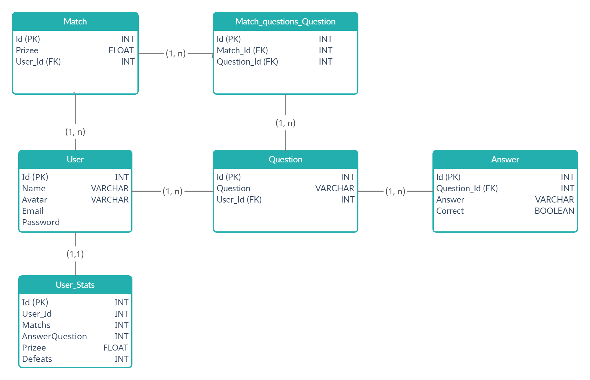
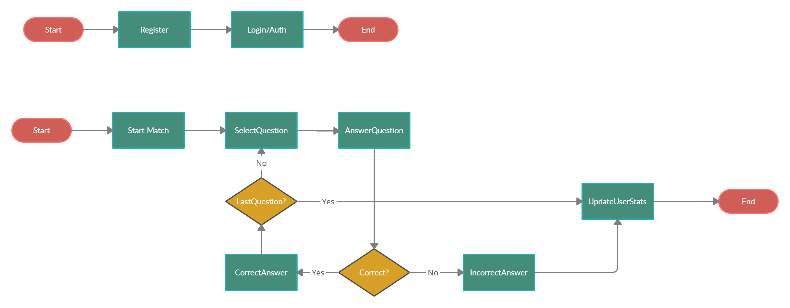

# Project
## _A quiz app designed for a college project_

## Features

- Add questions to the system
- View profile statistics
- Play and have fun

# Documentation

### Database Model

### Flow

## Tech

This project uses a number of open source projects to work properly:

- [Node.js](https://nodejs.org) - evented I/O for the backend
- [Express](https://expressjs.com) - fast node.js network app framework
- [TypeOrm](https://typeorm.io) - TypeORM is an ORM that can run in NodeJS 

### Links

- [Github Repository](https://github.com/Alairtonfl/projeto_2)
- [Interface Prototyping](https://www.figma.com/file/hSLlnNymgn4GL9zKUVcGxf/show-do-milh%C3%A3o?node-id=0%3A1)

### Members

- Ageu Oliveira da Costa 
- Antônio Alairton Ferreira Lima
- Antônio Mauricio Rodrigues Araújo Júnior 
- Carlos Eduardo Moura Rodrigues
